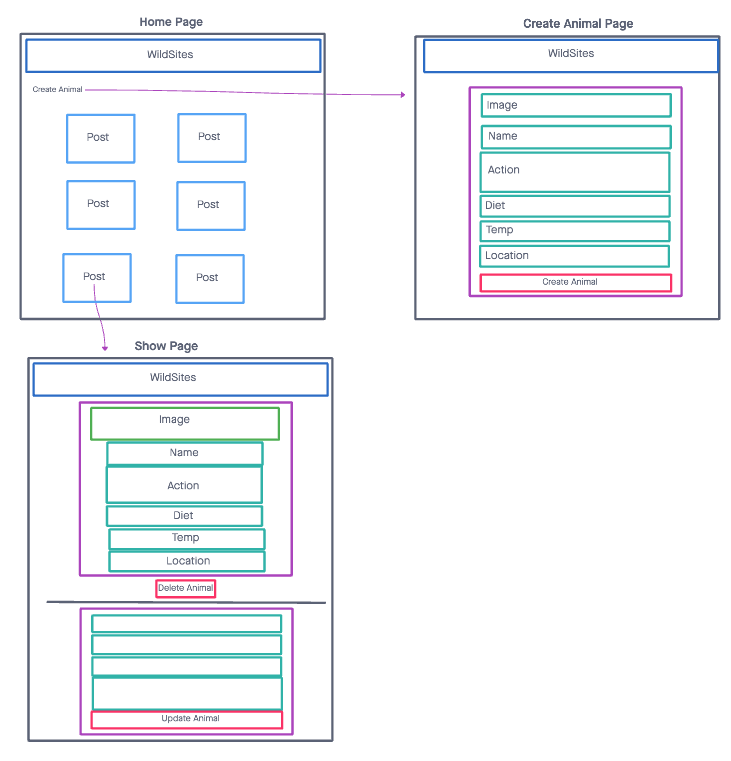

# WildSites - Project 4

Developers: Bobby S., Marlon S., Rodrigo B., Xavier C.

## Description:
The app is a working full-stack application hosted on Netlify. The user is be able to create, edit, update or delete (Full CRUD data operations) wildlife that they encounter on different hiking trails. Users are also able to view wildlife that others have encountered.

[Click here](https://github.com/xcarrillo1/backend-project4) to check the backend code!

## Technologies Used:
- ReactJS
- CSS
- Netlify

## Screenshots:
These screenshots show a quick sketch of what the app looks while the user navigates through it.

## Getting Started:
[Click here](https://suspicious-agnesi-b7033d.netlify.app/) to check the app out!

## Future Enhacements:
Have user authentication.